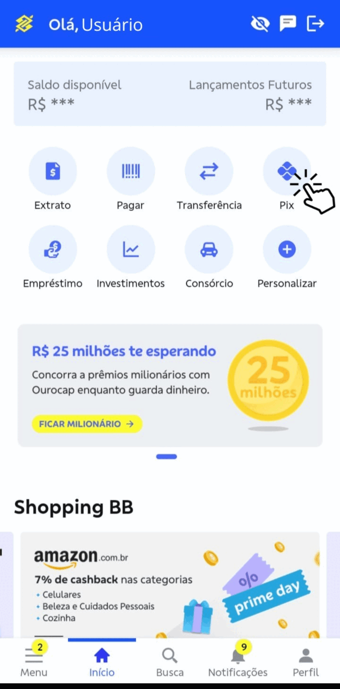

[toc]

# O que é o PIX?

O PIX é um modo de pagamento imediato criado pelo Banco Central. Permite transferências instantâneas e sem restrição de horário. O PIX utiliza apenas uma chave para identificar o destinatário, não necessitando de informações de agência ou conta do recebedor.

# O que é uma chave PIX?

Cada transferência depende de uma chave PIX,  um identificador único de uma conta. Esta chave pode tomar a forma de email, CPF, CNPJ, número de telefone, chave aleatória ou QR code.

# Como configurar minha chave PIX?

- Baixe nosso [aplicativo](./baixar_e_acessar_app.md#realizando-download-do-aplicativo)
- [Faça login no aplicativo](./baixar_e_acessar_app.md#acessando_o_aplicativo) e logue com conta e senha
- Acesse a área PIX
- Vá para a opção 'Minhas chaves'
- Escolha um [tipo de chave](#qual-opção-de-chave-é-melhor-para-mim)
- Caso esteja cadastrando uma chave de número ou email, insira o código de validação recebido por SMS ou Email.
- Confirme a criação da chave

Assista ao gif abaixo para ter um passo-a-passo detalhado de como configurar sua chave.

# Qual opção de chave é melhor para mim?

Ao escolher uma chave PIX, é importante considerar a conveniência e segurança de cada opção:

- CPF/CNPJ: Ideal para quem deseja utilizar um número de identificação fiscal vinculado à conta.
- E-mail ou número de telefone: Prático para transferências rápidas e acesso via dispositivo móvel em situções em que estes dados possam ser compartilhados.
- Chave aleatória: Recomendada para quem valoriza privacidade, pois não divulga informações pessoais diretamente.
- QR code: Excelente para transações presenciais, pois pode ser escaneado diretamente do dispositivo.

Escolha a opção que melhor se adapta às suas necessidades de uso e segurança ao realizar transações com o PIX.

# Quais cuidados preciso ter com minhas chaves PIX?

Ao utilizar e compartilhar suas chaves PIX, é necessário tomar algumas precauções para garantir a sua segurança:

- **Não compartilhe chaves desnecessariamente:**
  Evite compartilhar suas chaves PIX, como telefone, e-mail ou CPF, com pessoas desconhecidas. Prefira utilizar QR codes ou chaves aleatórias para evitar fraudes e outros riscos ao lidar com desconhecidos.
- **Use senhas seguras:** Se optar por usar um e-mail ou número de telefone como chave PIX, certifique-se de que suas contas de e-mail e dispositivos estejam protegidos por senhas fortes e atualizadas.
- **Atenção aos golpes:** Esteja ciente de golpes que possam envolver solicitações fraudulentas de informações de chave PIX. Instituições financeiras não pedem informações pessoais ou senhas por e-mail, SMS ou telefone.

Tome estes cuidados. Assim você poderá aproveitar ao máximo as funcionalidades do PIX com segurança.

# Artigos relacionados:

- [Como emitir um QR code com sua chave PIX](./emitir_qr_code.md)
- [Configure seus limites PIX](./limites_pix.md)
